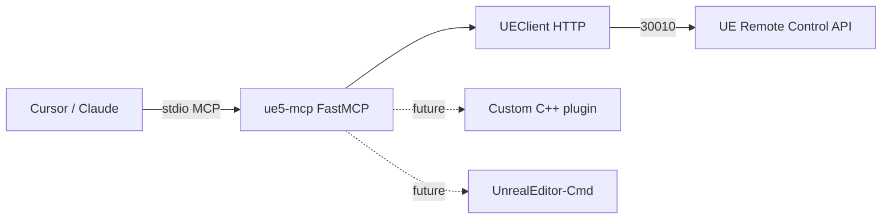

# ue5-mcp

Model Context Protocol (MCP) server for controlling **Unreal Engine 5** from AI agents (Cursor, Claude Desktop, etc.) using natural-language prompts.

This repo is **scaffolding only** — a small, working MCP server with a UE bridge stub you can grow in the direction you choose.

## Quick start

**Requirements:** Python 3.10+, [uv](https://docs.astral.sh/uv/) (recommended) or pip.

```bash
cd ue5-mcp
cp .env.example .env

# Install and run (stdio transport — used by Cursor/Claude)
uv sync --dev
uv run ue5-mcp
```

**Mock mode** (no editor required):

```bash
UE_MOCK_MODE=true uv run ue5-mcp
```

**Connect Cursor:** copy `config/cursor-mcp.example.json` into your Cursor MCP settings and set the absolute path to this repo. See [Cursor MCP docs](https://docs.cursor.com/context/mcp).

**Unreal setup (when not using mock mode):**

1. Open your project in the UE editor.
2. Enable **Edit → Plugins → Remote Control API**.
3. Restart the editor. Default HTTP port is `30010`.
4. Match `UE_HOST` / `UE_HTTP_PORT` in `.env`.

## Project layout

```
ue5-mcp/
├── pyproject.toml          # Dependencies, CLI entry point (ue5-mcp)
├── .env.example            # UE connection settings template
├── config/
│   └── cursor-mcp.example.json   # Sample Cursor MCP server config
├── src/ue5_mcp/
│   ├── server.py           # MCP entry: creates FastMCP, registers everything
│   ├── config.py           # Settings from environment (.env)
│   ├── bridge/
│   │   └── client.py       # HTTP client → Unreal Remote Control API
│   ├── tools/              # MCP *tools* (agent actions)
│   │   └── editor.py       # ue_ping, ue_get_editor_info (stubs)
│   ├── resources/          # MCP *resources* (read-only context)
│   │   └── engine.py       # unreal:// URIs for status/config
│   └── prompts/            # MCP *prompts* (workflow templates)
│       └── workflows.py    # explore_level, prototype_gameplay
└── tests/
    └── test_server.py
```

## What each part is for

| Piece | MCP primitive | Role |
|-------|---------------|------|
| **`server.py`** | — | Boots the server on **stdio** (how Cursor talks to local MCP servers). Calls `register_*` to attach tools, resources, and prompts. |
| **`config.py`** | — | Central env-based settings (host, ports, mock mode, future `.uproject` path). |
| **`bridge/client.py`** | — | **Not MCP** — this is your **Unreal transport**. Today it targets the built-in **Remote Control API** over HTTP. Later you can add a second client for a custom C++ plugin or `UnrealEditor-Cmd`. |
| **`tools/`** | Tools | Things the agent **does**: spawn actors, set properties, run console commands, build/cook, etc. Each `@mcp.tool()` becomes callable from the agent. |
| **`resources/`** | Resources | Things the agent **reads**: actor lists, selection, editor state, asset catalogs. Good for grounding prompts without side effects. |
| **`prompts/`** | Prompts | Reusable **playbooks** (“explore level before editing”, “prototype movement”) so users get consistent multi-step behavior. |

**MCP in one sentence:** your agent calls **tools** to change UE, pulls **resources** for context, and uses **prompts** as starting instructions for complex workflows.

## Development

```bash
uv sync --dev
uv run pytest

# Optional: MCP Inspector (debug JSON-RPC)
npx @modelcontextprotocol/inspector uv run ue5-mcp
```

## Architecture (today vs later)



## Paths you can take (tailor to your games)

Pick one primary **depth** strategy; you can combine them later.

### 1. Remote Control API only (fastest)

**Best for:** property tweaks, calling exposed Blueprint functions, level inspection, live tuning.

- Extend `UEClient` with Remote Control presets, `PUT` property routes, batch calls.
- Add tools: `list_actors`, `get_property`, `set_property`, `call_function`.
- **Game types:** any project that exposes gameplay via Blueprint-callable functions and RC presets (simulation, archviz, live ops).

### 2. Editor scripting + Python plugin

**Best for:** asset pipeline, bulk imports, Sequencer, Editor Utility Widgets.

- Add a UE **Editor Python** script layer or plugin that listens on a local socket; MCP tools send JSON commands.
- **Game types:** content-heavy (open world, RPG inventories, narrative pipelines), tooling/automation.

### 3. Custom C++ Automation Bridge plugin

**Best for:** Blueprint graph edits, spawning arbitrary classes, deep editor APIs, safer sandboxing.

- Ship `plugins/YourMcpBridge` in this repo; MCP talks HTTP/WebSocket to the plugin (see community projects like ChiR24/Unreal_mcp, remiphilippe/mcp-unreal).
- **Game types:** complex systems (multiplayer, GAS abilities, procedural generation, custom editors).

### 4. Headless / CI (no editor UI)

**Best for:** builds, tests, cooking, validation from the agent or CI.

- Tools wrap `UnrealEditor-Cmd`, UAT, Gauntlet; use `UE_PROJECT_PATH` from config.
- **Game types:** teams with automated test maps, nightly builds, compliance checks.

### 5. Genre-focused tool packs

Split `tools/` into modules and only enable what you need:

| Pack | Example tools | Fits |
|------|----------------|------|
| **FPS / action** | spawn weapon pickups, configure character movement, damage volumes | Shooter prototypes |
| **Narrative** | Dialogue assets, level sequences, trigger volumes | Story games |
| **Multiplayer** | replicate settings, player starts, network profiling hooks | Online games |
| **Mobile / casual** | UI widgets, touch input presets, LOD/cook profiles | Mobile titles |
| **Procedural** | PCG graphs, landscape layers, instanced meshes | Roguelikes, open worlds |

### 6. Safety and UX layers

- **Mock mode** (included): develop MCP tools without UE running.
- **Read-only default**, explicit `confirm=true` on destructive tools.
- **Capability tokens** if you expose the bridge on LAN.
- **Resources** for “current selection” so the agent asks before deleting.

## Next steps (suggested order)

1. Verify mock mode and Cursor MCP wiring.
2. With UE open, harden `ue_ping` against your UE version’s Remote Control routes.
3. Add `list_actors` + `spawn_actor` tools via Remote Control.
4. Add one workflow prompt per game you’re building (e.g. “third-person controller setup”).
5. Decide if you need a C++ plugin or if Remote Control is enough.

## License

MIT — see [LICENSE](LICENSE).
