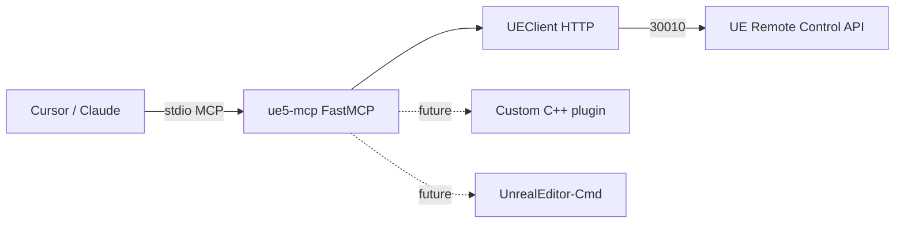

# ue5-mcp

Model Context Protocol (MCP) server for controlling **Unreal Engine 5** from AI agents (Cursor, Claude Desktop, etc.) using natural-language prompts.

This repo is **scaffolding only** — a small, working MCP server with a UE bridge stub you can grow in the direction you choose.

## Quick start

**Requirements:** Python 3.10+, [uv](https://docs.astral.sh/uv/) (recommended) or pip.

```bash
cd ue5-mcp
cp .env.example .env

# Install and run (stdio transport — used by Cursor/Claude)
uv sync --dev
uv run ue5-mcp
```

**Mock mode** (no editor required):

```bash
UE_MOCK_MODE=true uv run ue5-mcp
```

**Connect Cursor:** copy `config/cursor-mcp.example.json` into your Cursor MCP settings and set the absolute path to this repo. See [Cursor MCP docs](https://docs.cursor.com/context/mcp).

**Unreal setup (when not using mock mode):**

1. Open your project in the UE editor.
2. Enable **Edit → Plugins → Remote Control API**.
3. Restart the editor. Default HTTP port is `30010`.
4. Match `UE_HOST` / `UE_HTTP_PORT` in `.env`.

## Project layout

```
ue5-mcp/
├── pyproject.toml          # Dependencies, CLI entry point (ue5-mcp)
├── .env.example            # UE connection settings template
├── config/
│   └── cursor-mcp.example.json   # Sample Cursor MCP server config
├── src/ue5_mcp/
│   ├── server.py           # MCP entry: creates FastMCP, registers everything
│   ├── config.py           # Settings from environment (.env)
│   ├── bridge/
│   │   └── client.py       # HTTP client → Unreal Remote Control API
│   ├── tools/              # MCP *tools* (agent actions)
│   │   └── editor.py       # ue_ping, ue_get_editor_info (stubs)
│   ├── resources/          # MCP *resources* (read-only context)
│   │   └── engine.py       # unreal:// URIs for status/config
│   └── prompts/            # MCP *prompts* (workflow templates)
│       └── workflows.py    # explore_level, prototype_gameplay
└── tests/
    └── test_server.py
```

## What each part is for

| Piece | MCP primitive | Role |
|-------|---------------|------|
| **`server.py`** | — | Boots the server on **stdio** (how Cursor talks to local MCP servers). Calls `register_*` to attach tools, resources, and prompts. |
| **`config.py`** | — | Central env-based settings (host, ports, mock mode, future `.uproject` path). |
| **`bridge/client.py`** | — | **Not MCP** — this is your **Unreal transport**. Today it targets the built-in **Remote Control API** over HTTP. Later you can add a second client for a custom C++ plugin or `UnrealEditor-Cmd`. |
| **`tools/`** | Tools | Things the agent **does**: spawn actors, set properties, run console commands, build/cook, etc. Each `@mcp.tool()` becomes callable from the agent. |
| **`resources/`** | Resources | Things the agent **reads**: actor lists, selection, editor state, asset catalogs. Good for grounding prompts without side effects. |
| **`prompts/`** | Prompts | Reusable **playbooks** (“explore level before editing”, “prototype movement”) so users get consistent multi-step behavior. |

**MCP in one sentence:** your agent calls **tools** to change UE, pulls **resources** for context, and uses **prompts** as starting instructions for complex workflows.

## Development

```bash
uv sync --dev
uv run pytest

# Optional: MCP Inspector (debug JSON-RPC)
npx @modelcontextprotocol/inspector uv run ue5-mcp
```

## Architecture (today vs later)



## Paths I'm considering for building this MCP

I can combine these later, but it helps to pick a **main** direction first. This section explains each path in plain language (not just jargon).

### 1. Remote Control only — talk to the editor over its built-in web API

**What I'd be doing:** Unreal has a plugin called **Remote Control API**. When it's on, the editor acts like a small web server on my machine (usually port `30010`). This MCP server sends HTTP requests — "list this," "change that property," "call this Blueprint function."

**In simple terms:** I'm not writing Unreal code yet. I'm building a **remote control** for the editor that already exists, and my AI agent uses MCP tools to press those buttons.

**Technically:** extend `UEClient` with Remote Control presets, property routes, and batch calls; add tools like `list_actors`, `get_property`, `set_property`, `call_function`.

**Good if:** I want to move actors, tweak values, call Blueprint functions I've already exposed, and iterate while the editor is open.

**Not great if:** I need to edit Blueprint graphs node-by-node or do things the API doesn't expose.

---

### 2. Editor Python / utility scripts — automate boring editor work

**What I'd be doing:** Unreal can run **Python inside the editor** (for tooling, not usually for shipped game logic). I write scripts that import assets, batch-rename things, drive Sequencer, etc. My MCP server tells those scripts what to run.

**In simple terms:** The agent doesn't "become" Unreal — it **runs helper scripts** in my project, and those scripts do the work in the editor.

**Technically:** add an Editor Python layer or plugin that listens on a local socket; MCP tools send JSON commands to it.

**Good if:** My game is **content-heavy** (lots of levels, assets, cinematics) and I care more about pipeline speed than live combat tweaking.

**Not great if:** I mainly need real-time gameplay control while playing in the editor.

---

### 3. C++ bridge plugin — a custom middleman inside Unreal

**What the words mean:**

- **Plugin** — extra code I drop into my project's `Plugins` folder; Unreal loads it when the project opens.
- **Bridge** — the **middleman** between my MCP server (Python, outside Unreal) and the editor (inside Unreal).
  - Outside: Cursor → my MCP server
  - Middle: the bridge (often HTTP or WebSocket **inside** the editor)
  - Inside: Unreal does the real work (spawn actors, edit Blueprints, etc.)
- **C++** — that middleman is written in C++, which is how most serious editor features are built in UE. Python MCP can't call deep editor APIs directly; the plugin can.

**In simple terms:** I'm building a **custom remote control that lives inside Unreal**, because the built-in Remote Control API isn't enough. My MCP server sends messages like "spawn this" or "add this Blueprint node," and the plugin understands Unreal's internal APIs.

**Technically:** ship something like `plugins/YourMcpBridge` in this repo; MCP talks HTTP/WebSocket to the plugin. Community examples: [ChiR24/Unreal_mcp](https://github.com/ChiR24/Unreal_mcp), [remiphilippe/mcp-unreal](https://github.com/remiphilippe/mcp-unreal).

**Good if:** I want **deep control** — Blueprint editing, custom tools, "AI using the editor like a human."

**Cost:** more work (C++ compile times, UE version updates, maintaining a plugin).

---

### 4. Headless / CI — builds and tests without the editor UI

**What the words mean:**

- **Headless** — run Unreal **without the normal editor window** (command-line mode). No clicking in viewports — just commands.
- **CI** (continuous integration) — automated checks on every commit/PR: build the game, run tests, catch breakages before I merge.

**What I'd be doing:** My MCP (or a CI script) runs commands like "build this project," "run these automated tests," "cook content for a platform" — using Unreal's command-line tools (`UnrealEditor-Cmd`, etc.), not the visual editor.

**In simple terms:** The agent helps with **factory work** — "does it compile?", "do tests pass?" — not "move this lamp two units left in the level."

**Technically:** tools wrap `UnrealEditor-Cmd`, UAT, Gauntlet; use `UE_PROJECT_PATH` from config.

**Good if:** I care about **stable builds and automated testing**.

**Not a replacement for:** live level design while I'm in the editor.

---

### 5. Genre tool packs — only expose tools my game actually needs

**What I'd be doing:** Instead of one giant "do everything in Unreal" MCP, I split `tools/` into **packs** and only enable what matches my game:

| Pack | Example tools | Fits |
|------|----------------|------|
| **FPS / action** | spawn weapon pickups, configure character movement, damage volumes | Shooter prototypes |
| **Narrative** | dialogue assets, level sequences, trigger volumes | Story games |
| **Multiplayer** | player starts, replication settings, network profiling hooks | Online games |
| **Mobile / casual** | UI widgets, touch input presets, LOD/cook profiles | Mobile titles |
| **Procedural** | PCG graphs, landscape layers, instanced meshes | Roguelikes, open worlds |

**In simple terms:** I'm **curating the agent's toolbox** so it doesn't get dozens of irrelevant tools and make weird choices.

**Good if:** I know my genre early and want safer, more focused behavior.

---

### 6. Safety layer — guardrails so the agent doesn't wreck my project

**What I'd be doing:** Rules around dangerous actions:

- **Mock mode** (included) — fake responses when UE isn't running; good for building MCP without the editor open.
- **Read-only by default** — agent can look, not delete, until I allow it.
- **Confirm destructive stuff** — e.g. "delete all actors in level" needs an explicit yes.
- **Tokens / LAN** — if the bridge listens on the network, only trusted clients can connect.

**In simple terms:** I treat the agent like a **junior dev with permissions**, not root access to my whole project.

**Technically:** read-only defaults, `confirm=true` on destructive tools, capability tokens on LAN, resources for "current selection" so the agent checks before deleting.

---

### How I might choose

| If my main goal is… | I'd probably start with… |
|---------------------|---------------------------|
| Place things and tweak gameplay while the editor is open | **Remote Control only** (path 1) |
| Tons of assets and pipeline grunt work | **Editor Python** (path 2) |
| AI edits Blueprints and does "real editor" tasks | **C++ bridge plugin** (path 3) |
| Builds and tests run automatically | **Headless / CI** (path 4) |
| Building one type of game and want focus | **Genre tool packs** (path 5) |
| Scared of the agent deleting my level | **Safety layer** (path 6) — often combined with another path |

**Realistic combo:** start with **path 1** (what this repo is aimed at), add **path 6** early, then add **path 3** only when I hit a wall ("Remote Control can't do X"). **Path 4** is separate — useful when I care about builds/tests, not day-one level design.

### One-sentence cheat sheet

| Term | Meaning |
|------|---------|
| **Remote Control** | Use Unreal's built-in HTTP remote for the editor. |
| **C++ bridge plugin** | My own small program *inside* Unreal that obeys my MCP server. |
| **Headless / CI** | Unreal with no UI, for builds and automated tests. |
| **Genre packs** | Only give the agent tools that match my game type. |
| **Safety layer** | Mock mode, confirmations, and limits so mistakes stay small. |

## Next steps

1. Verify mock mode and Cursor MCP wiring.
2. With UE open, harden `ue_ping` against your UE version’s Remote Control routes.
3. Add `list_actors` + `spawn_actor` tools via Remote Control.
4. Add one workflow prompt per game you’re building (e.g. “third-person controller setup”).
5. Decide if you need a C++ plugin or if Remote Control is enough.

## License

MIT — see [LICENSE](LICENSE).
